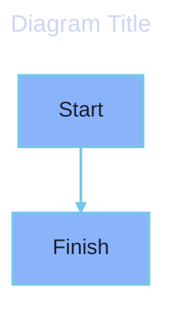

# Shared Documentation Formats

> **Core rule:** Treat `.md` and `.html` as two renderings of the same documentation contract. Keep identity, structure, navigation, links, assets, and accessibility equivalent.

<details>
  <summary>Table of Contents</summary>

- [1. Scope and format parity](#1-scope-and-format-parity)
- [2. Metadata contract](#2-metadata-contract)
- [3. Document shape and navigation](#3-document-shape-and-navigation)
- [4. Paths, assets, links, and IDs](#4-paths-assets-links-and-ids)
- [5. Accessibility and visual content](#5-accessibility-and-visual-content)
- [6. Narrow legacy and R&D overrides](#6-narrow-legacy-and-rd-overrides)
- [7. Actionable examples](#7-actionable-examples)

</details>

## 1. Scope and format parity

- Apply this rule to every documentation `.md` and `.html` document, including contents pages, indexes, guides, references, and rendered companions.
- Keep the same information architecture in both formats: metadata, title, numbered sections, heading-derived TOC/navigation, path references, links, assets, and accessibility text must describe the same document.
- A repository may add stricter renderer requirements, but it must preserve the contract below. Do not invent a second metadata vocabulary for HTML.

## 2. Metadata contract

Every covered document has exactly these five metadata fields, in this order: `title`, `description`, `type`, `tags`, and `updated`. Keep field names and values equivalent when a Markdown document has an HTML companion. Use a non-empty `description`, a stable `type`, a list for `tags`, and an ISO date (`YYYY-MM-DD`) for `updated`.

- **Markdown (`.md`):** Put YAML frontmatter before the body and before the H1.
- **HTML (`.html`):** Put an equivalent comment block immediately before `<!DOCTYPE html>`, with no bytes or markup between the comment and doctype.

```md
---
title: Deployment Guide
description: Safe steps for deploying the service
type: guide
tags: [deployment, operations]
updated: 2026-07-23
---

# Deployment Guide
```

```html
<!--
title: Deployment Guide
description: Safe steps for deploying the service
type: guide
tags: [deployment, operations]
updated: 2026-07-23
-->
<!DOCTYPE html>
```

Do not hide document identity in a filename, page title, or CSS only. The metadata `title` must match the visible document title; `description`, `type`, `tags`, and `updated` must remain machine-readable in either format.

### `type` vocabulary

`type` is a closed set. Use exactly one of these values (established across `~/docs`):

| `type` | Use for |
| --- | --- |
| `guide` | How-to / user guide (the default for most documents) |
| `reference` | Reference material (APIs, configs, catalogs) |
| `adr` | Architecture Decision Record |
| `plan` | Implementation plan (superpowers) |
| `spec` | Design spec (superpowers) |
| `research` | Research / investigation output (superpowers) |
| `index` | A section hub / landing index page |
| `contents` | A structural folder-contents page (lists every child) |
| `handoff` | A session/agent handoff document |

`tags` is an open list; prefer an existing tag (`superpowers`, `desktop`, `memory`, `architecture`, `home`, `agents`, `understand-anything`, `documentation`, `caddy`, …) over minting a new one. `updated` is `YYYY-MM-DD`.

### Frontmatter is mandatory for build health

This is not just a convention — it is a **build requirement**. The home docs site (`infra/docs-site`, Astro + Starlight) symlinks `src/content/docs → ~/docs` and ingests **every** `.md` file as a Starlight content-collection entry. A Markdown file without valid YAML frontmatter (at minimum `title`) fails the collection schema and **breaks the entire site build** (`InvalidContentEntryDataError`), not just that one page. HTML files are served as static assets via `public/s-a-c/` and do not need frontmatter (they carry the equivalent comment block). So: **every committed `.md` under `~/docs` MUST carry the five-field frontmatter before it lands on `main`**, or the next docs-site rebuild fails. The same OKF/Starlight-compatible frontmatter keeps the docs portable across any frontmatter-aware static-site generator.

## 3. Document shape and navigation

- Provide one document title: exactly one plain H1 in Markdown; exactly one visible H1 in HTML, plus the HTML `<title>` element. The visible titles must match the metadata `title`.
- Number every H2, H3, and H4 hierarchically (`## 1.`, `### 1.1.`, `#### 1.1.1.`). Do not skip a level or reset numbering inside a document.
- Put a complete heading-derived TOC immediately after the Markdown H1. In HTML, provide an equivalent semantic `<nav aria-label="Table of contents">` near the document introduction. Include every H2-H4 heading exactly once, in document order, with nested links.
- Every documentation folder follows its repository path/navigation contract: its structural contents page lists every direct child (including non-Markdown assets) with relative links, and its semantic index links relevant topics to headings. Link a child folder through that folder's contents page.
- Keep navigation equivalent across `.md` and `.html`; a styled visual menu is not a substitute for heading-derived links.

## 4. Paths, assets, links, and IDs

- Respect the repository's path-prefix grammar. In a `docs/` tree governed by a path-prefix rule, use unique path-derived prefixes, reserved contents/index pages, and valid sibling tails; do not create a parallel prefix scheme.
- Use relative links for repository-local documents and assets. Link to the actual target, preserve the target's stable path, and do not link to temporary, generated, or ignored files.
- Markdown TOC links use the target renderer's stable heading fragments. Keep heading text and punctuation stable; do not rely on an accidental slug that changes when formatting changes.
- HTML H2-H4 headings that are navigation targets have explicit, unique, lowercase kebab-case `id` values. Update all inbound links when an intentional identity change is unavoidable.
- List direct non-Markdown assets in folder contents navigation. Give every referenced asset a meaningful name and keep its relative path stable.

## 5. Accessibility and visual content

- Meet WCAG 2.1 AA basics: sufficient contrast, visible focus, no color-only meaning, readable text, and logical keyboard order.
- Every meaningful image, chart, diagram, screenshot, and rendered visual has useful alt text (`` in Markdown or `alt="..."` in HTML) or a nearby text summary when alt text cannot carry the detail. Mark an image decorative only when it adds no information.
- HTML links and controls must be semantic and keyboard accessible. Use `<a href>` for navigation and `<button>` for actions; do not make a clickable `div` or span. Provide a visible focus state and an accessible name.
- Every Mermaid block and standalone `.mmd` source begins with YAML frontmatter. Use the recommended **`redux-dark-color`** theme and set `themeVariables.fontSize` to `16px`. This theme/palette is a portable default; a repository may override it with an explicit, documented substitute.
- Use the shared **Catppuccin Mocha** palette consistently (the recommended default, overridable by repository config): Base `#1e1e2e` for the canvas and edge-label backgrounds, Text `#cdd6f4` for text on dark surfaces, Blue `#89b4fa`, Mauve `#cba6f7`, and Teal `#94e2d5` for primary/secondary/tertiary fills, Sapphire `#74c7ec` for strokes and edges, Lavender `#b4befe` for secondary borders, Sky `#89dceb` for tertiary borders, and Surface0 `#313244` for clusters. Use Base text (`#1e1e2e`) on the bright accent fills and Text (`#cdd6f4`) on dark fills.
- Keep text/background pairs at or above WCAG AA contrast (4.5:1 for normal text); keep edges and other graphical marks visibly distinct from their background. Do not use color alone to encode meaning.
- Extend the shared `themeVariables` with diagram-specific configuration rather than replacing it. Use `sequence`, `journey`, and `er` configuration for renderer-owned colors and layout. ER diagrams use `direction TB`, and may use `defaultRenderer: elk` with explicit spacing for readable portrait layouts.
- Use `UpdateElementStyle` and `UpdateRelStyle` for C4 node and relationship styling. If a renderer ignores a label color, use a narrowly scoped `%%{init: {"themeCSS": ...}}%%` directive for that label only; do not apply a global text override that reduces contrast inside bright nodes.
- Quote labels containing spaces, punctuation, or parser-sensitive characters with double quotes. Keep simple identifiers and ER relationship roles unquoted when the Mermaid grammar accepts them. Split dense diagrams into focused views instead of shrinking labels. Supply alt text or a text summary for the rendered diagram.



## 6. Narrow legacy and R&D overrides

An explicit, discoverable legacy or R&D override may relax presentation only: for example, emoji, decorative layout, collapsible styling, or renderer-specific TOC presentation. It may not remove or weaken metadata, document identity, heading/link safety, stable IDs, path safety, asset coverage, keyboard access, alt text/text summaries, contrast, or Mermaid readability minimums. Keep the override local to the smallest tree and state which presentation choice it changes.

## 7. Actionable examples

- Before adding a guide, create the five metadata fields, one H1, numbered H2-H4 sections, and a TOC containing every section.
- Before adding an image or Mermaid diagram, add its alt text or summary, verify contrast, and add the asset to the containing folder's contents page.
- Before renaming a heading or HTML `id`, search its inbound links and update them in the same change; preserve the old identity when compatibility is required.

## See Also

- `s-a-c-doc-tree-prefixes` — the path-prefix grammar this skill assumes.
- `s-a-c-software-doc-lifecycle` — decision flow that fills these documents.
